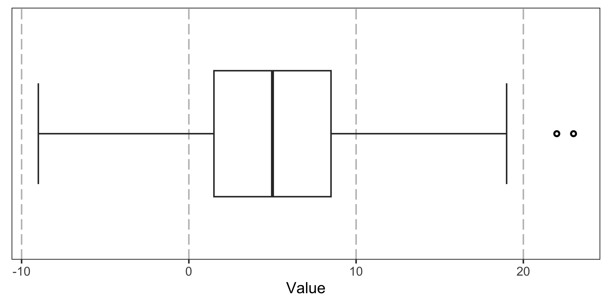
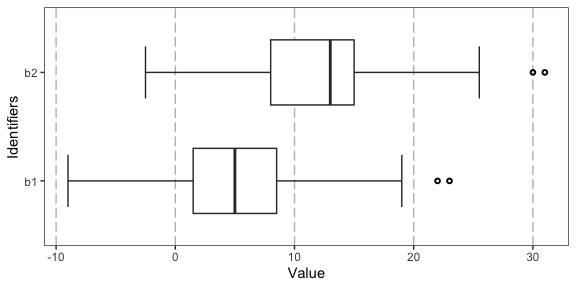
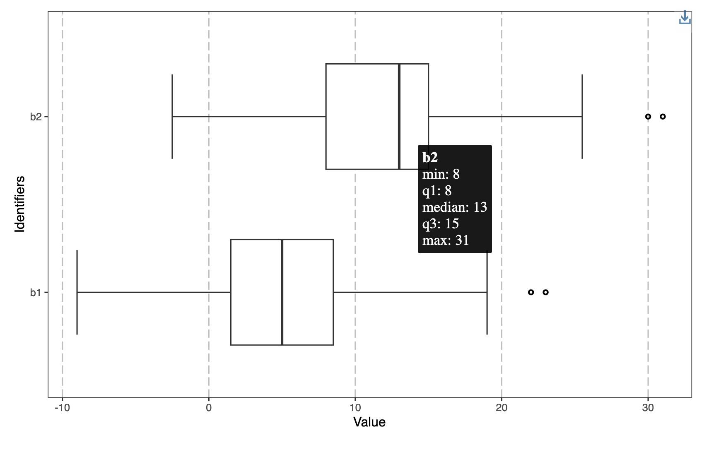

<!-- README.md is generated from README.Rmd. Please edit that file -->

# boxplotstats

<!-- badges: start -->

[](https://github.com/selkamand/boxplotstats/actions/workflows/R-CMD-check.yaml)
[](https://app.codecov.io/gh/selkamand/boxplotstats?branch=main)

[](https://github.com/selkamand/boxplotstats)


<!-- badges: end -->

The `boxplotstats` package provides functions to calculate and visualize
boxplot summary statistics for numeric data, including handling grouped
data.

The most common use-case for this package is you have lots of data e.g.
from. bootstrapping experiments that you don’t want to store, but you
may want to plot.

## Installation

You can install the development version of boxplotstats from
[GitHub](https://github.com/) with:

``` r
# install.packages("devtools")
devtools::install_github("selkamand/boxplotstats")
```

## Usage

### Calculate Boxplot Summary Statistics

To calculate boxplot summary statistics for a single numeric vector:

``` r
library(boxplotstats)

# Example numeric vector
vec <- c(1, 2, 3, 4, 5, 6, 7, 8, 9, 10, 100)

# Calculate boxplot statistics
boxplot_stats <- calculate_boxplot_stats(vec)

# Print the results
print(boxplot_stats)
#>     min max  q1  q3 iqr median outlier_low_threshold outlier_high_threshold
#> 25%   1 100 3.5 8.5   5      6                    -4                     16
#>     outliers
#> 25%      100
```

For a more complex example with outliers:

``` r
# Numeric vector with outliers
vec_with_outliers <- c(rep(1, times = 3), 1:10, 22, 23)

# Calculate boxplot statistics
boxplot_stats_with_outliers <- calculate_boxplot_stats(vec_with_outliers)

# Print the results
print(boxplot_stats_with_outliers)
#>     min max  q1  q3 iqr median outlier_low_threshold outlier_high_threshold
#> 25%   1  23 1.5 8.5   7      5                    -9                     19
#>     outliers
#> 25%   22, 23
```

### Calculate Boxplot Summary Statistics for Multiple Groups

To calculate boxplot summary statistics for multiple groups:

``` r
# Example values and group IDs
values <- c(1, 1, 1, 1, 2, 3, 4, 5, 6, 7, 8, 9, 10, 22, 23, 8, 8, 8, 12, 13, 14, 15, 30, 31)
ids <- c("b1", "b1", "b1", "b1", "b1", "b1", "b1", "b1", "b1", "b1", "b1", "b1", "b1", "b1", "b1", "b2", "b2", "b2", "b2", "b2", "b2", "b2", "b2", "b2")

# Calculate boxplot statistics for multiple groups
group_stats <- calculate_boxplot_stats_for_multiple_groups(values, ids)

# Print the results
print(group_stats)
#>   min max  q1   q3 iqr median outlier_low_threshold outlier_high_threshold
#> 1   1  23 1.5  8.5   7      5                  -9.0                   19.0
#> 2   8  31 8.0 15.0   7     13                  -2.5                   25.5
#>   outliers id
#> 1   22, 23 b1
#> 2   30, 31 b2
```

### Visualise Boxplots

``` r
# Plot a single boxplot
plot_boxplot_stats(boxplot_stats_with_outliers)
```



``` r

# Plot multiple boxplots
plot_boxplot_stats(group_stats, ylab = "Identifiers")
```



### Render interactive boxplots

Add a tooltip to your plot with `make_interactive()`


